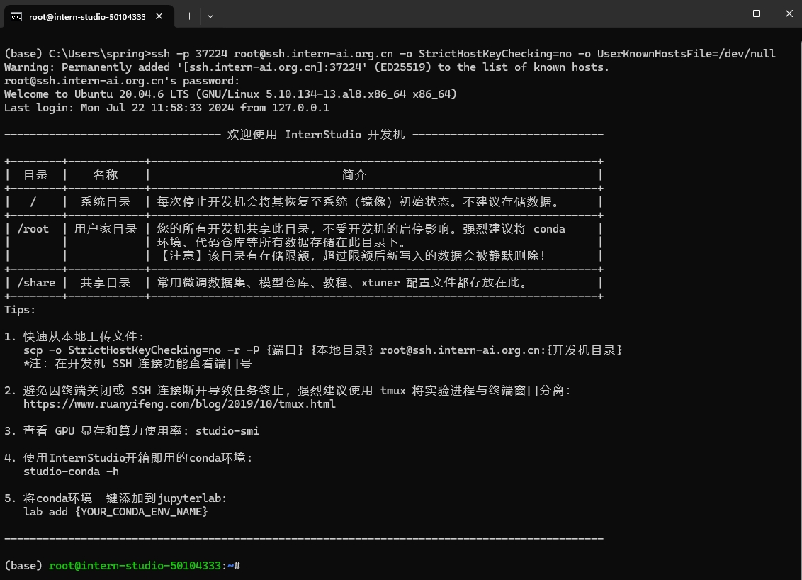
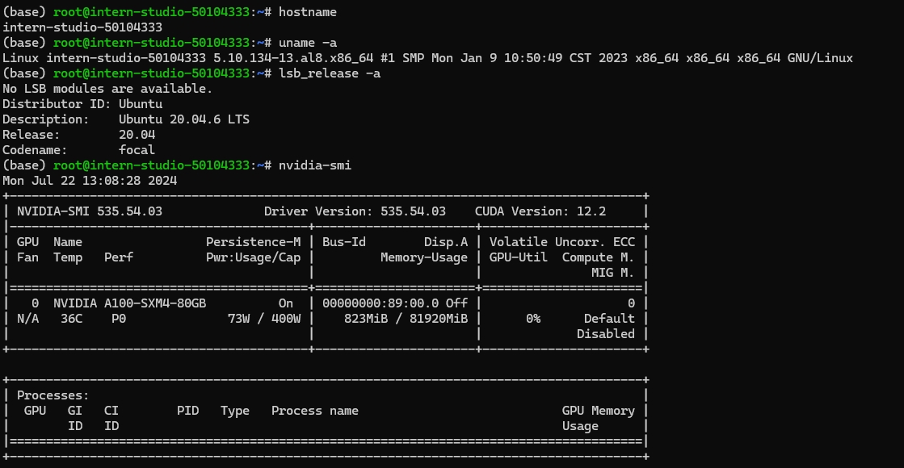
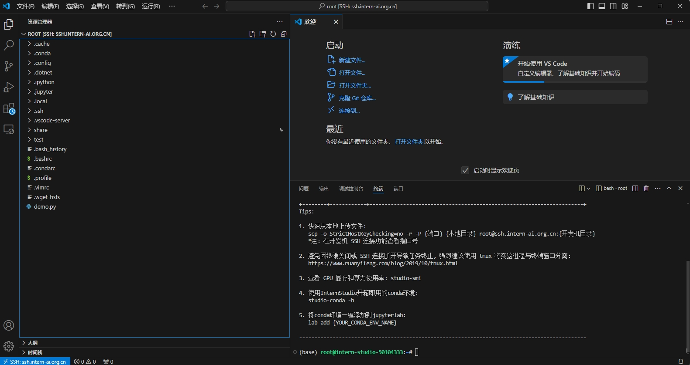
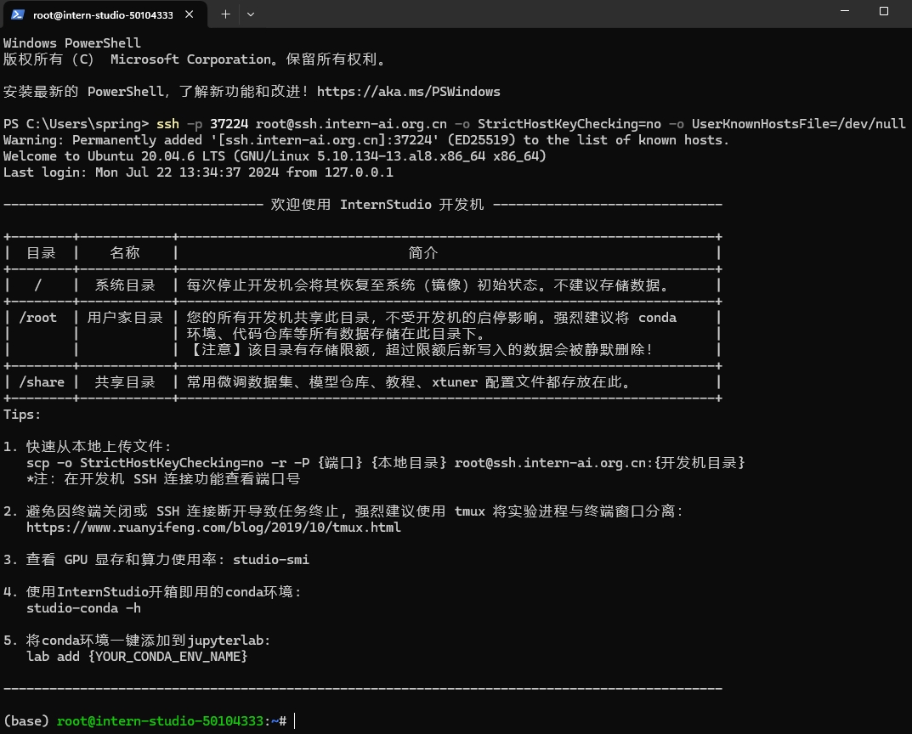
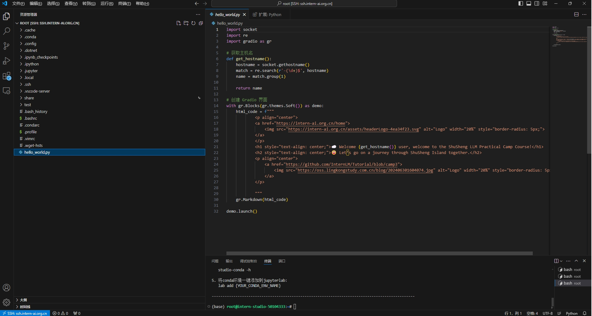
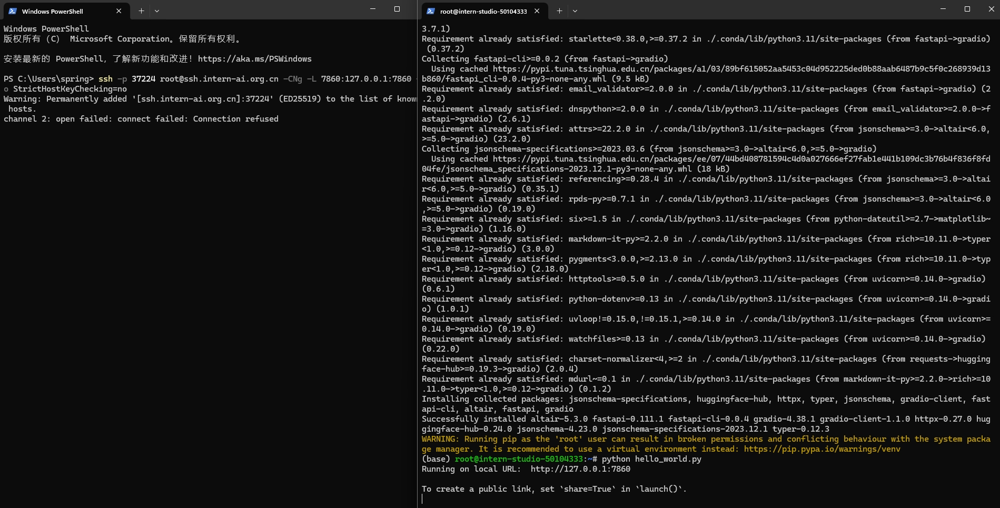
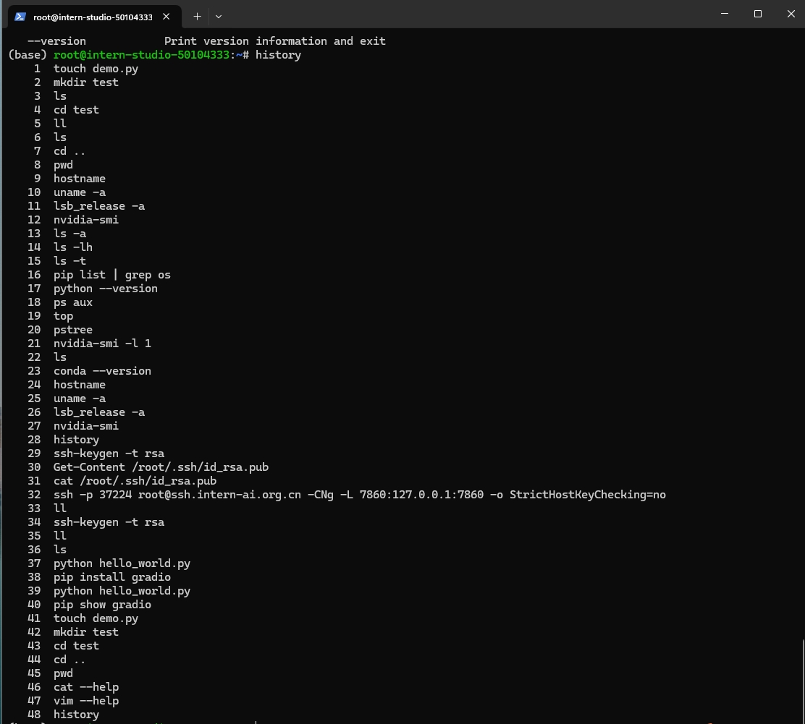

## 1、创建并启动开发机

## 2、SSH远程访问开发机

## 3、常规操作

## 4、使用VScode进行SSH远程连接

## 5、配置SSH密钥进行SSH远程连接

## 6、hello_world文件的编辑

## 7、运行hellow_word.py文件（安装gradio包）

## 8、使用ssh命令进行端口映射并在浏览器中访问

## 9、常用的Linux命令

